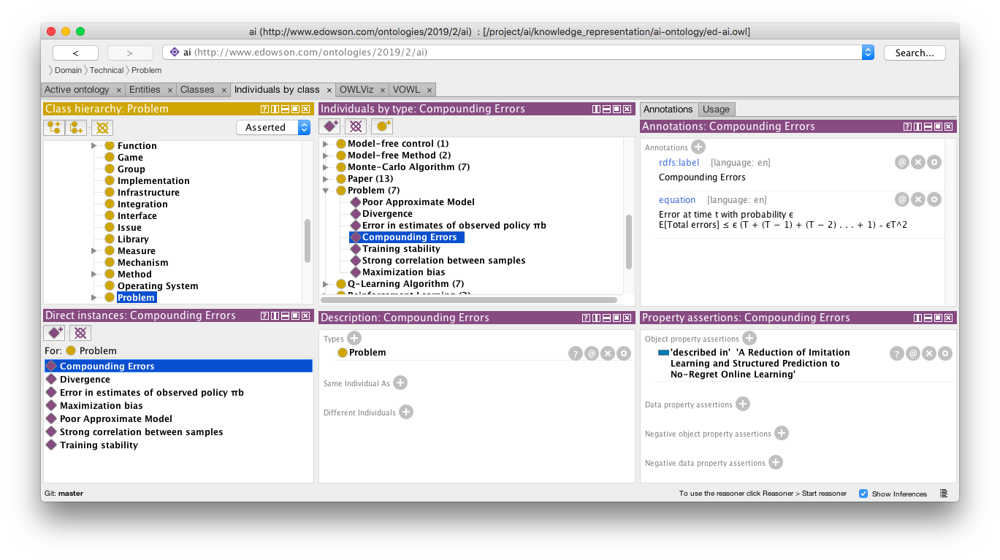
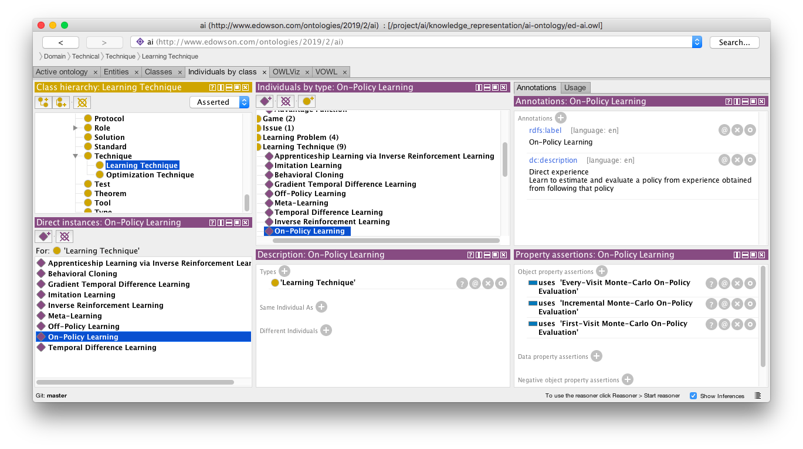
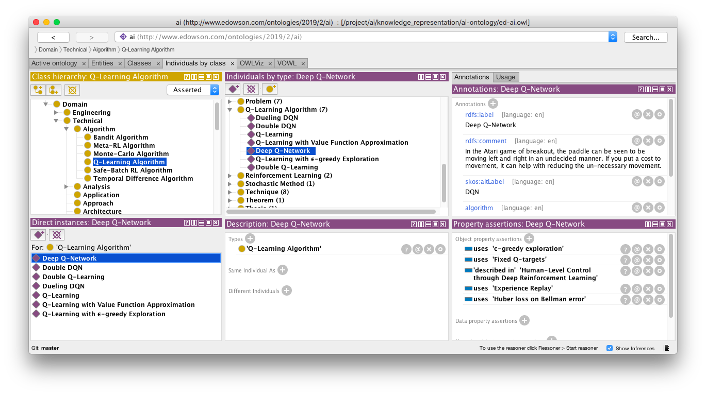
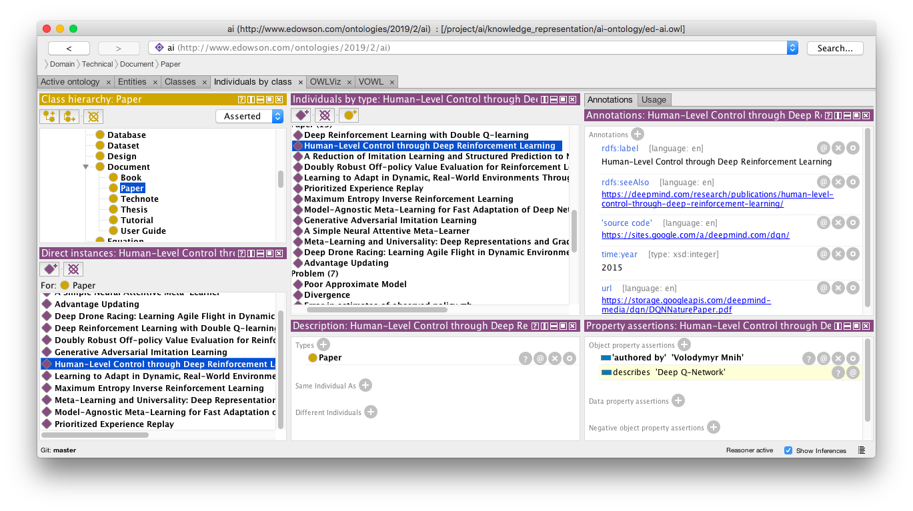
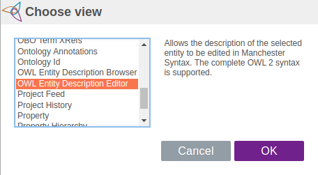
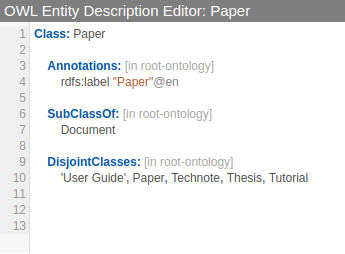

# AI/RL Ontology

This repository contains an Artificial Intelligence / Reinforcement Learning Ontology in RDF/OWL format.

## Motivation

The AI/RL ontology project was started to help keep up with the pace of AI/RL development.

## Usage

### Using [Protege](https://protege.stanford.edu)

Load the `ed-ai.owl` file and start a reasoner.

You can update the ontology or browse the sample RL instances, to perform queries such as:

- Problems encountered in reinforcement learning:

- List of RL techniques for on-policy learning:

- List of Q-learning algorithms and their properties:

- List of papers, authors and the algorithms and techniques described in those papers:

### Using [WebProtege](https://webprotege.stanford.edu)

Use the following settings you are using [WebProtege](https://webprotege.stanford.edu) to edit the RDF/OWL file.

**New Entity Settings**
IRI Prefix: http://www.edowson.com/ontologies/2019/2/ai#
IRI Suffix: Supplied name
Spaces: Collapse and transform to CamelCase

**New Entity Language Settings**
Annotation property: rdfs:label
Language tag: en

**Display Name Settings**
Display name property and language priority: rdfs:label, en
Display name fallback: Fallback to IRI local name

## Editing

### Specify disjoint classes axiom

Add the "OWL Entity Description Editor" view by click on the Classes tab menu and choosing it in the pop-up window.

You can add disjoints by using the `DisjointClasses:` keyword followed by a list of classes that should be disjoint.

Remember to use 'quotes' for classes that you are referring to using `rdfs:label`.
